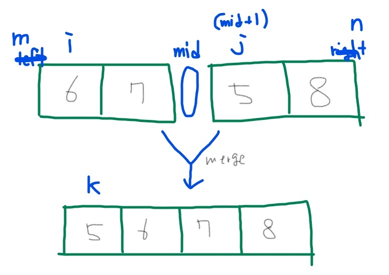

```c
#include <stdio.h>

int sorted[10];
// 임시 배열을 전역으로 선언해준다.
// 병합정렬은 반으로 나누며, 합치고 하는 과정에서 또 다른 배열이 필요한데,
// 필요할 때마다 배열을 만들어주면 비효율적임.(불필요한 메모리 사용문제)
// 메모리 공간을 동적으로 잡아주거나 
// 모든 함수가 공통적으로 사용할 수 있게끔 전역으로 선언 해주자.

// 부분 배열을 이용해서 새롭게 배열을 만드는 함수
void merge(int a[], int m, int middle, int n) {

    int i = m;
    int j = middle + 1;
    int k = m;

    // 작은 값을 k에 삽입
    while (i <= middle && j <= n) {
        if (a[i] <= a[j]) {
            sorted[k] = a[i];
            i++;
        }
        else {
            sorted[k] = a[j];
            j++;
        }
        k++;
    }
    // i쪽 애들 먼저 끝나서 다 넣었으면 j쪽 애들 넣어주기
    if (i > middle) {
        for (int t = j; t <= n; t++) {
            sorted[k] = a[t];
            k++;
        }
    }
    // j쪽 애들 먼저 끝나서 다 넣었으면 i쪽 애들 넣어주기
    else {
        for (int t = i; t <= middle; t++) {
            sorted[k] = a[t];
            k++;
        }
    }

    // 정렬된 임시 배열을 본 배열에 삽입
    for (int t = m; t <= n; t++) {
        a[t] = sorted[t];
    }
}


void mergeSort(int a[], int m, int n) {
    // m < n 인 경우에만 실행. 반대는 탈출조건
    if (m >= n) return;

    else { // if(m<n)
        int middle = (m + n) / 2;
        mergeSort(a, m, middle); // 왼쪽꺼쪼개기
        mergeSort(a, middle + 1, n); //오른쪽꺼쪼개기
        merge(a, m, middle, n); // 합침
    }
}

int main()
{
    int array[8] = { 0,-6,5,5,2,5,9,-1 };
    mergeSort(array, 0, 7);
    for (int i = 0; i < 8; i++) {
        printf("%d ", array[i]);
    }

    return 0;
}

```
```
퀵정렬은 최악의 경우 O(N^2)라서 평균속도인 O(NlogN)을 보장을 못한다.
병합정렬은 퀵정렬보다는 평균적으로 느리지만 O(NlogN)을 보장할 수 있다. 빠르며, 불규칙적이지 않다.
```

```
mid를 저렇게 그림으로 띄워놨지만, 사실상 메모리는 저렇지 않고 이어져있는 셈이다. 따라서
각 분기문, 반복문의 부등호를 잘 파악해야 한다.
안그러면 NULL값(0)이랑 연산해버린다.
```
